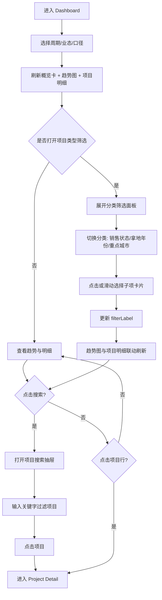
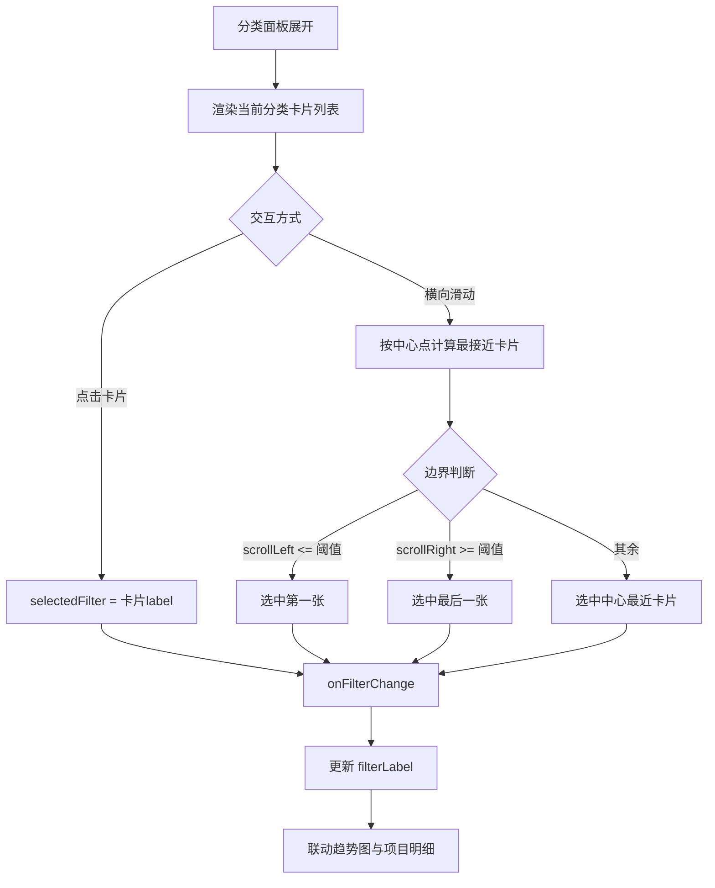
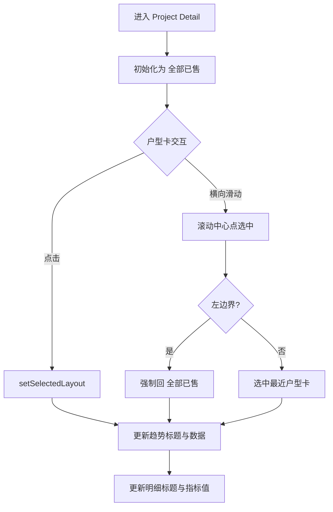
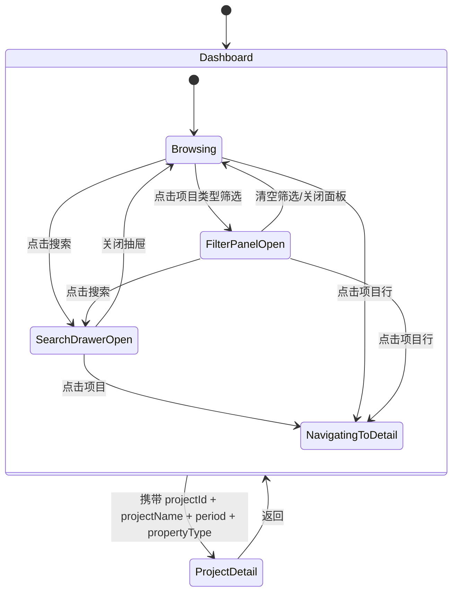
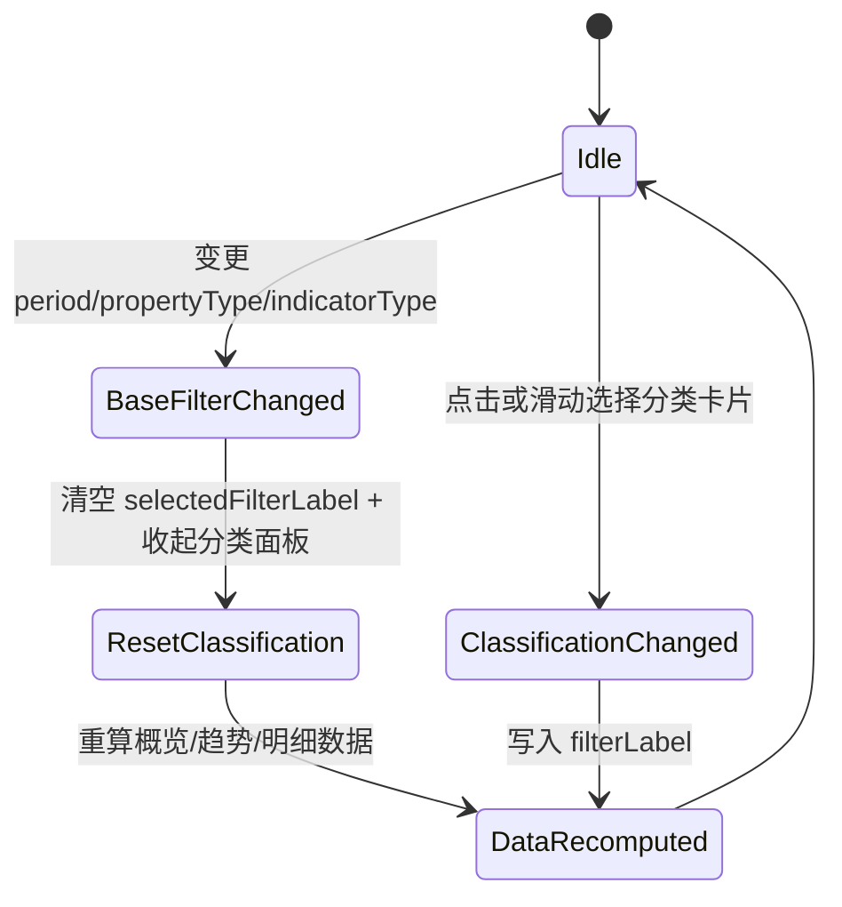
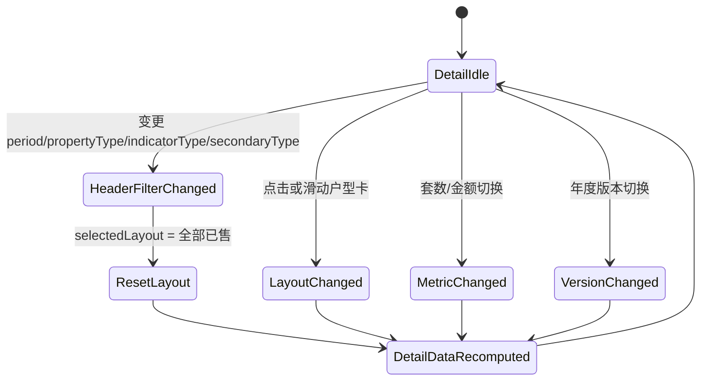

# 房地产销售看板交互设计文档

## 1. 文档目标
基于当前实现，明确关键用户路径、组件联动关系与页面状态流转，作为后续迭代与测试参考。

## 2. 关键状态模型

### 2.1 Dashboard 状态
- `period`: `当日 | 当月 | 当年`
- `propertyType`: `住宅 | 商办 | 车储`
- `indicatorType`: `协议 | 合同`
- `filterLabel`: 分类筛选选中的子项标签，空字符串表示未筛选
- `isSearchOpen`: 项目搜索抽屉开关

### 2.2 Overview/Classification 状态
- `showFilter`: 是否展开分类筛选面板
- `filterType`: `status | landYear | city`
- `selectedFilterLabel`: 当前选中的分类子项
- `selectedFilter`: 卡片滚动联动计算出的当前选中项

### 2.3 Project Detail 状态
- `period`, `propertyType`, `indicatorType`
- `selectedSecondaryType`: 业态二级分类
- `selectedLayout`: `全部已售` 或具体户型
- `metricType`: `套数 | 金额`
- `selectedVersion`: 年度版本对比项

## 3. 交互流程图

### 3.1 主流程（看板到详情）

### 3.2 分类筛选卡片交互流程

### 3.3 项目详情户型联动流程

## 4. 状态流转图

### 4.1 页面级状态流转

### 4.2 Dashboard 数据状态流转

### 4.3 Project Detail 数据状态流转

## 5. 联动规则汇总
- 看板页：`period/propertyType/indicatorType/filterLabel` 是趋势图和项目明细共同输入。
- 分类卡片：点击与滑动都可以触发 `filterLabel` 更新。
- 项目详情：`selectedLayout` 同时驱动趋势图和明细表。
- 日期明细：统一按时间倒序（左新右旧）渲染，保证趋势与明细时间理解一致。

## 6. 实现约束与注意事项
- 粘性表头必须与表体处于同一横向滚动容器，防止列宽错位和右侧溢出。
- 移动端搜索输入字号保持 `>=16px`，避免 iOS 聚焦自动缩放。
- 卡片滚动选中需包含左右边界兜底，避免首尾项不可达。
